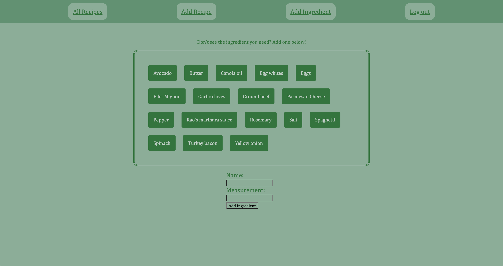

# Easy Peasy Recipes
## Date: 05/25/2023
### By: Wilson Fung

***

### **_Description_**
#### Gone are the days of having to write down your grandma's chicken noodle soup recipe in a notebook that'll get thrown away the next time you decide to do some spring cleaning. Keep track of all your recipes in this app and never worry again about possibly losing the family secrets!

***

### **_Application_**

#### You can use the deployed app [here](https://easypeasyrecipes-58eb109fac1a.herokuapp.com/)

#### You can track the progress of future updates here: [Trello](https://trello.com/b/m3nwpYhu/easy-peasy-recipes).

***

### **_Technologies Used_**

- CSS
- Javascript
- EJS
- Node.js
- Express
- MongoDB
- Mongoose
- OAuth

***

### **_Screenshots_**

### **_Credits_**

##### Markdown Cheatsheet: [Markdown Guide] (https://www.markdownguide.org/cheat-sheet/)